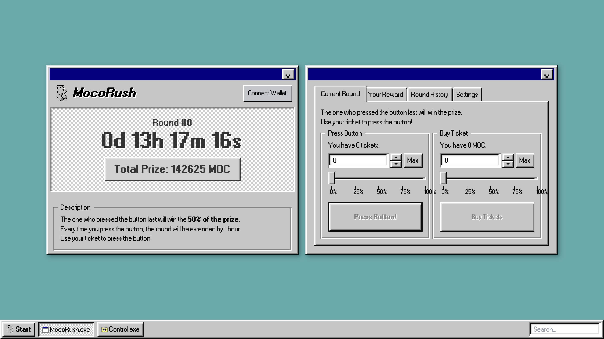

# MOCO Rush

### Game Rules & Mechanism:

1. **How to win?**
    - It's a game where you use your tickets to press a button within a set time.
    - The last person to press the button before the game ends takes 50% of the prize pool.
    - Each time a player uses a ticket to press the button, the game's end time is extended.
    
    **Distribution of prizes among players**:
    
    - 10% of the remaining 50% of the prize pool is transferred to the next round's prize pool, and the remaining 40% is distributed among all participants based on the proportion of tickets purchased.
    - For instance, if 100 tickets were sold in the entire game and one person bought 10 tickets, that person would receive 10% of the remaining prize pool.
2. **Ticket-based participation**:
    - Players purchase game tickets using MOC tokens. Each ticket purchase contributes to the game's 'prize pool'.
    - The end time of each round of the game is set randomly, and tickets can be purchased until this end time.
3. **Where does the prize come from?**
    - 10% of the previous round's prize is set as the initial betting amount.
    - Subsequently, the ticket purchase amount for the round is collected as a prize, and a random amount may also be supplied (by a foundation or a specific person's donation).

### Stimulating FOMO and increasing participation:

1. **Real-time prize updates**:
    - The current size of the prize pool is updated in real time in the game. This stimulates players' FOMO and encourages more ticket purchases.
        1. **Prize pool composition**:
            - The game's prize pool consists of the revenue generated from all tickets purchased by players.
            - A certain percentage of the price of each ticket sold is automatically added to the prize pool.
        2. **Prize increase mechanism**:
            - The total amount of the prize pool increases each time a ticket is purchased.
            - This increase is calculated and updated in real time by the game's server or smart contract.

      
## Further Considerations:
- **Automation with Chainlink**: As of now, the demo version requires manual operation to count rounds. However, implementation with Chainlink could potentially automate this process and streamline gameplay.
- **Design Concept - Windows 98**: The design concept for the game is based on the Windows 98 interface. This follows the popular Y2K design trend, symbolising a sense of 'hipness' and nostalgia among players.

- Additional elements to consider implementing in order to increase engagement.
    1. **Referral reward system**:
    - Existing players create a team, invite new players to the game, and get an additional 1+1 ticket reward each time a ticket is purchased.
    
    b. **Leaderboard system** :
    - Existing players create a team, invite new players to the game, and get an additional 1+1 ticket reward each time a ticket is purchased.
      
### Expected Benefits for Users:

- **Engagement and Community Building**: The proposed referral and leaderboard systems encourage players to form teams and invite new players, fostering a sense of community and competition. This could lead to greater user engagement and retention in the Mossland Metaverse.
- **Rewards and Incentives**: The game's reward system, which grants additional tickets for player referrals, provides direct incentives for user participation and growth of the player base. This not only benefits individual players but also contributes to the overall health and expansion of the Mossland Metaverse.
- **Automated and Streamlined Gameplay**: The potential integration with Chainlink could automate the round counting process, making the gameplay more efficient and enjoyable. This technological enhancement could attract tech-savvy users and stimulate their continued participation.
- **Nostalgia and Novelty**: The design concept, based on the Windows 98 interface, taps into the popular Y2K design trend. This unique blend of nostalgia and hipness could appeal to a wide range of players, adding a fun and distinctive element to their experience in the Mossland Metaverse.

## To try demo: [https://mocorush.pages.dev/](https://mocorush.pages.dev/)https://mocorush.pages.dev/
